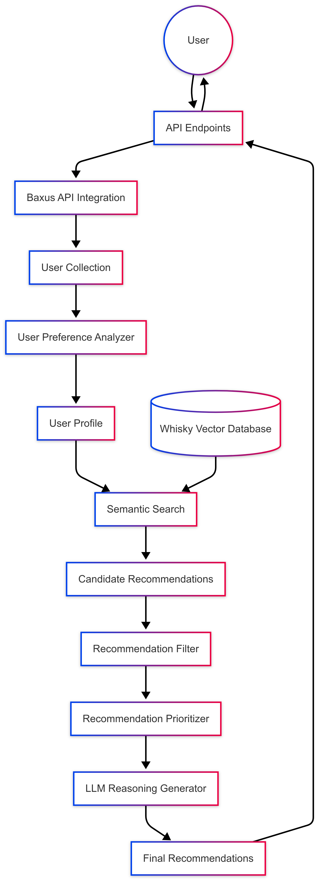
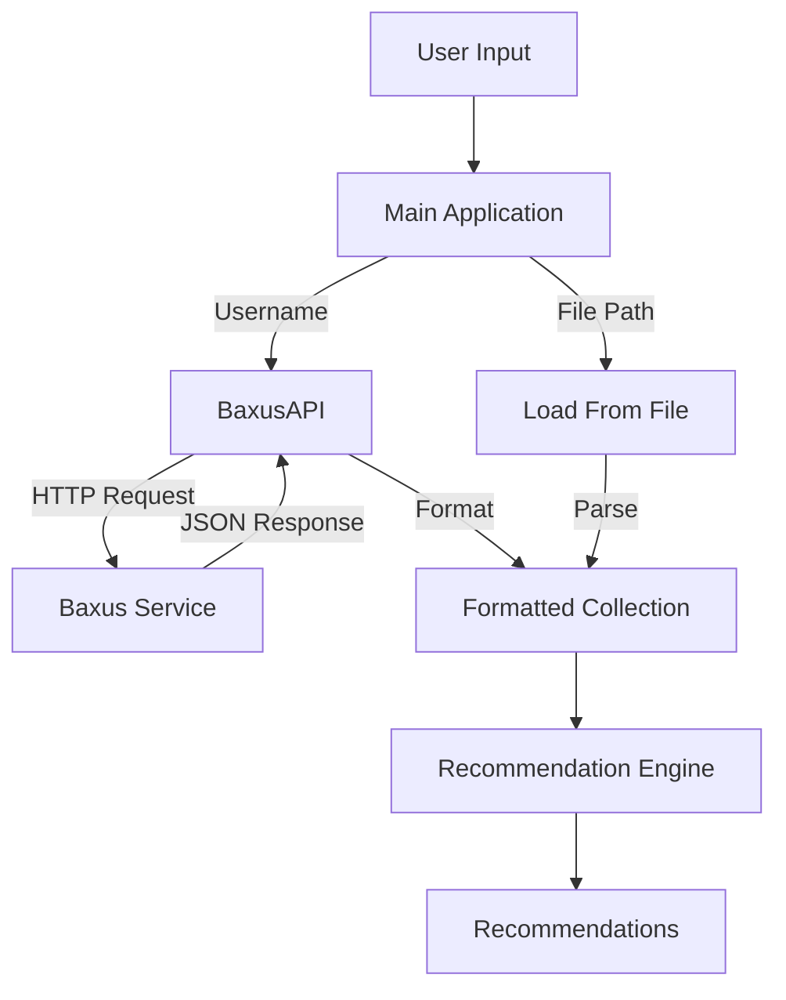

# Bob AI Technical Documentation

## System Architecture Overview

Bob AI leverages a Retrieval-Augmented Generation (RAG) architecture to provide personalized whisky recommendations. This document details the technical implementation and data flow.





## Core Technical Components

### 1. Vector Database with Embeddings

The system stores a comprehensive dataset of whiskies in a vector database (Chroma DB), where each whisky is represented as a high-dimensional embedding vector.

**Implementation Details:**
- **Embedding Model**: We use `text-embedding-3-small` from OpenAI to create embeddings that capture the semantic properties of each whisky.
- **Vector Store**: Chroma DB is used to efficiently store and query these vector embeddings.
- **Persistence**: Embeddings are persisted to disk for faster startup and reuse.

**Benefits**:
- Enables semantic search based on similarity rather than keyword matching
- Allows for effective "fuzzy" matching of whiskies with similar characteristics
- Supports efficient nearest-neighbor queries for recommendation generation

```python
# Create vector store from whisky dataset
self.vector_store = Chroma.from_documents(
    documents=whisky_documents,
    embedding=self.embeddings,
    collection_name="whisky_collection",
    persist_directory=self.persist_directory,
)
```

### 2. User Preference Analysis Engine

A sophisticated analysis engine that extracts detailed user preferences from their collection.

**Implementation Details:**
- **Multi-dimensional Analysis**: Examines patterns in spirit types, price ranges, ABV preferences, and more.
- **Spirit Type Profiling**: Creates detailed profiles for each spirit type in the user's collection.
- **Characteristic Detection**: Identifies specific characteristics that may explain user preferences (e.g., preference for high-proof spirits).

**Key Methods:**
- `_extract_user_preferences`: Analyzes collection to generate a comprehensive preference profile
- `_analyze_type_characteristics`: Detects patterns within specific spirit types
- `_generate_user_profile`: Creates a human-readable description of the user's preferences

### 3. Semantic Search and Recommendation Pipeline

**Workflow Steps:**
1. **Query Construction**: The system generates a search query based on the user's profile
2. **Semantic Search**: This query is used to retrieve the most semantically similar whiskies from the vector database
3. **Filtering**: Recommendations are filtered to remove items already in the user's collection and those outside their price range
4. **Prioritization**: Recommendations are prioritized based on user's spirit type preferences while ensuring diversity
5. **Reasoning Generation**: An LLM generates personalized reasoning for each recommendation

**Example of Semantic Search:**
```python
def _semantic_search(self, query: str, k: int = 40) -> List[Document]:
    """
    Perform semantic search on the whisky vector store.
    Returns the k most similar whiskies to the query.
    """
    return self.vector_store.similarity_search(query, k=k)
```

### 4. LLM Integration for Personalized Reasoning

The system uses GPT-4 to generate personalized reasoning for each recommendation, explaining why it matches the user's preferences.

**Implementation Details:**
- **Context-Rich Prompts**: Includes detailed user profile and candidate recommendations
- **Structured Output**: Requests responses in JSON format for easy parsing
- **Fallback Handling**: Implements fallback mechanisms in case of parsing errors
- **Interesting Facts**: Includes interesting facts about each recommended whisky

**Example Prompt Structure:**
```
You are Bob, a whisky expert AI assistant.

User's whisky collection:
{collection details}

Detailed user profile:
{user preferences and patterns}

Potential recommendations:
{candidate details with metadata}

Based on the detailed user profile, provide personalized reasoning for each recommendation...
```

### 5. API Integration and Endpoints

The system exposes several REST API endpoints for integration:

1. **GET /get/recommendation/{username}**: Get recommendations for a user by their Baxus username
2. **POST /api/recommendations**: Get recommendations based on a provided collection
3. **POST /api/analyze**: Analyze a collection and return a user profile

## Baxus API Integration

The `BaxusAPI` class is responsible for fetching user collections from the Baxus service.

**Implementation Details:**
- **Endpoint**: Uses `{base_url}/api/bar/user/{username}` to fetch a user's collection
- **Formatting**: Transforms the API response into a standardized collection format for recommendation processing

```python
class BaxusAPI:
    def __init__(self, base_url="http://services.baxus.co"):
        self.base_url = base_url
        
    def get_user_collection(self, username: str) -> List[Dict[str, Any]]:
        """Fetch a user's collection from the Baxus API"""
        url = f"{self.base_url}/api/bar/user/{username}"
        # HTTP request and processing...
```

## Complete Workflow Explanation

1. **User Interaction**:
   - User requests recommendations through an API endpoint, providing either a username or collection data
   - If a username is provided, the system fetches the user's collection from the Baxus API

2. **Data Processing**:
   - The user's collection is standardized into a consistent format
   - The collection is analyzed to extract detailed preference patterns

3. **User Profile Generation**:
   - A comprehensive user profile is generated, capturing preferences for:
     - Spirit types and their distribution
     - Price ranges
     - ABV/proof preferences
     - Specific characteristics within each spirit type

4. **Search Query Construction**:
   - A search query is constructed based on the user profile
   - This query is formatted to maximize the effectiveness of semantic search

5. **Vector Database Search**:
   - The search query is used to perform a semantic search in the vector database
   - Initial candidates are retrieved based on semantic similarity

6. **Filtering and Prioritization**:
   - Candidates are filtered to remove items already in the collection
   - Remaining candidates are prioritized based on user preferences
   - The system ensures diversity in recommendations

7. **Reasoning Generation**:
   - For each recommendation, detailed personalized reasoning is generated using GPT-4
   - The reasoning explains why the recommendation matches the user's preferences
   - Interesting facts about each whisky are included to enhance user engagement

8. **Response Formatting**:
   - The final recommendations, reasoning, and user profile are formatted into a structured response
   - This response is returned to the user through the API

This end-to-end workflow ensures that recommendations are not only technically optimized but also personalized and explainable, providing a superior user experience compared to traditional recommendation systems.

## Performance Considerations

- **Embedding Caching**: Whisky embeddings are cached to disk to avoid redundant computation
- **Efficient Filtering**: Multi-stage filtering process to reduce the number of candidates before LLM processing
- **Prompt Optimization**: Carefully designed prompts to maximize the quality of generated reasoning
- **Error Handling**: Robust error handling throughout the pipeline to ensure reliability

## Future Enhancements

- Integration of user wishlist data to further refine recommendations
- Support for collaborative filtering to leverage patterns across users
- Enhanced explanation generation with more detailed whisky characteristics
- Real-time updating of the vector database as new whiskies become available

## API Module

The `bob_ai/api.py` module provides interfaces for interacting with the Baxus API and handling collection data. This document details the implementation specifics and data flow.

### BaxusAPI Class

The `BaxusAPI` class is responsible for making requests to the Baxus API and formatting the responses.

```python
class BaxusAPI:
    def __init__(self, base_url="http://services.baxus.co"):
        self.base_url = base_url
        
    def get_user_collection(self, username: str) -> List[Dict[str, Any]]:
        """Fetch a user's collection from the Baxus API"""
        
    def _format_collection(self, raw_collection: Dict[str, Any]) -> List[Dict[str, Any]]:
        """Format the raw API response into a standardized collection format"""
```

### Data Flow



### Collection Format

The API formats raw Baxus data into the following standardized format:

```json
{
  "id": "unique_identifier",
  "name": "Product Name",
  "size": "750ml",
  "proof": 90.0,
  "abv": 45.0,
  "spirit_type": "Bourbon",
  "msrp_avg": 59.99,
  "fair_price": 65.00,
  "shelf_price": 69.99
}
```

### Error Handling

The API implements robust error handling:
- HTTP request errors (connection issues, timeouts)
- Invalid API responses (malformed JSON)
- Missing or incomplete data fields
- File access errors when loading local files

### Usage Example

```python
# Initialize the API client
api_client = BaxusAPI()

# Fetch a user's collection from the API
collection = api_client.get_user_collection("username123")

# Or load from a local file (for testing or development)
local_collection = load_collection_from_file("path/to/collection.json")
```

## Token Counting

The application includes a token counting feature to help track and manage API usage costs:

```python
class TokenUsageTracker:
    def __init__(self):
        self.prompt_tokens = 0
        self.completion_tokens = 0
        self.total_tokens = 0
        
    def add_prompt_tokens(self, count: int) -> None:
        """Add prompt tokens to the tracker"""
        
    def add_completion_tokens(self, count: int) -> None:
        """Add completion tokens to the tracker"""
        
    def get_cost_estimate(self) -> Dict[str, Any]:
        """Calculate the estimated cost based on token usage"""
        
    def reset(self) -> None:
        """Reset token counters to zero"""
```

This helps with debugging and monitoring costs associated with API requests during development and production use. 